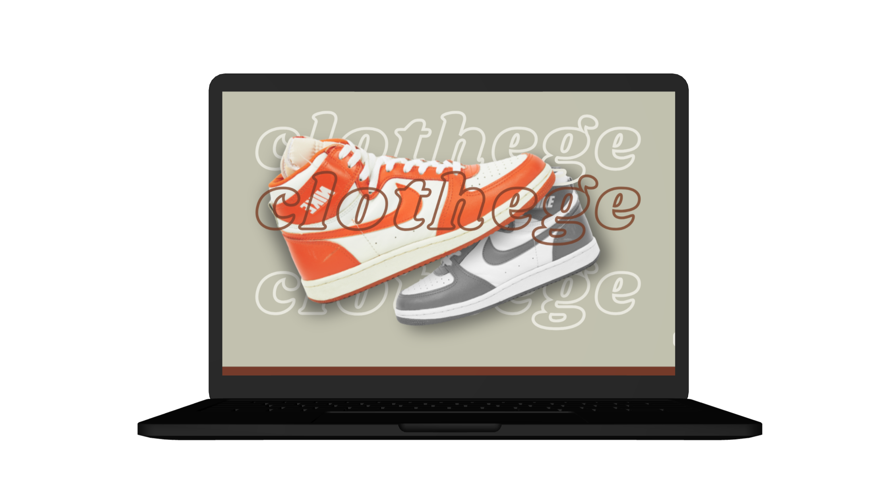

# Clothege
Clothege es la parte frontend de un e-commerce de zapatillas vintage para el Proyecto Final del curso de ___Backend___ y la parte de backend se realizó una [api](https://github.com/camyael/api-ecommerce).

* [Demo de la página](https://clothege.netlify.app/)



## Características
* Carrito
* Catálogo de Compra
* Registro
* Login
* Recuperación de contraseña

## Tecnologías, librerías e íconos
* React Js
* Hooks utilizados: useState, useEffect y useContext
* Icons8
* NodeJs
* Axios
* react-router-dom

## Creación e Instalación:

Este proyecto se inició con [Create React App](https://github.com/facebook/create-react-app).

Para acceder al proyecto, deberás ejecutar en la consola:
````
$ git clone https://github.com/camyael/clothege.git
````

Antes de iniciar el proyecto, primero debes crear un archivo .env con una variable de entorno a la altura de la carpeta src.

````
REACT_APP_URL_BACKEND = http://localhost:8080
````


Para instalar las dependencias, en el directorio del proyecto ejecute: 
````
$ npm install 
$ npm start
````

La parte de [backend](https://github.com/camyael/api-ecommerce) también debe ejecutarse al mismo tiempo.

## Autor
* Camila Villaverde — [LinkedIn](https://www.linkedin.com/in/camilavillaverde/) y [Portfolio](https://camyael.github.io/portfolio/)